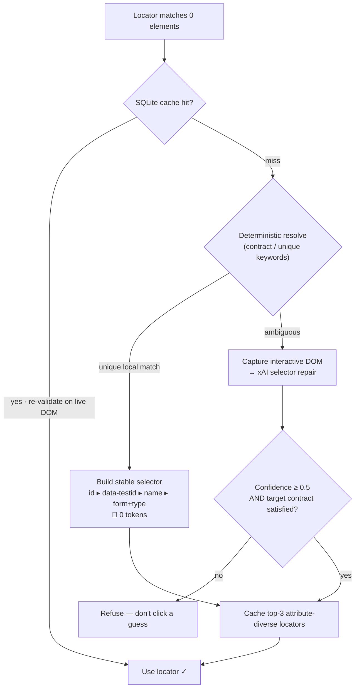
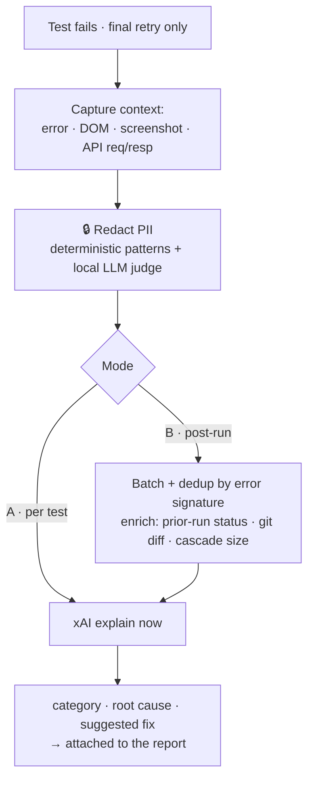

# TestMu SDET-1 — AI-Native Quality Engineering

[](https://mrnewdelhi.github.io/testmu-sdet1-anmol/)

An AI-native test framework built for the TestMu SDET-1 challenge. Beyond the required tasks, it grows a **self-healing locator engine** and a **failure-intelligence pipeline** across 11 iterations — each one a real, tested step, wired to a live LLM (xAI Grok), with a **deterministic-first, privacy-first** design.

**▶ Live interactive demo:** [mrnewdelhi.github.io/testmu-sdet1-anmol](https://mrnewdelhi.github.io/testmu-sdet1-anmol/)

- **Stack:** TypeScript · Playwright · SQLite (`node:sqlite`) · xAI Grok
- **Live demos:** the hosted visualizer above · `npm run test:self-healing` (all versions) · `npm run serve:demo` (local)
- **The interesting part:** an LLM is used as a *judge and last resort*, not a hammer — deterministic code and a cache do the cheap work, guardrails gate the model's output, and user data is redacted before it ever leaves the box.

---

## The pipeline

Two cooperating pipelines. The first keeps tests *running* when the UI drifts; the second explains *why* they broke when they shouldn't.

### 1 · Self-healing locators (v1–v6)



### 2 · Failure intelligence (v7–v11, Task 3 Option A)



---

## Concepts worth highlighting

| Concept | Where it lives | Why it matters |
| --- | --- | --- |
| **🧠 LLM as a Judge** | Confidence scoring caps the model's self-reported number with measured signals; failure **classification** (product-bug / environment / flaky / test-bug); a **local** model judges residual PII. | The model *ranks and rules*, it doesn't get blind trust. Every LLM output is verified or bounded. |
| **🪝 Hooks & MITM** | Auto-fixtures wrap the test lifecycle; `RecordingApi` sits in front of `APIRequestContext` (a man-in-the-middle on HTTP); `captureInteractiveDom` intercepts page state. | Context is captured transparently — tests don't change, the framework observes. |
| **💸 Token economics** | Deterministic-first resolution (v5), SQLite locator cache (v3) + multi-locator fallback (v6), post-run dedup of cascades (v9), final-attempt-only + per-run budget. | The LLM is the *expensive last resort*. Most breaks cost **0 tokens**; cascades collapse to one call. |
| **🔒 User-data security** | PII redaction over the full text (v11): patterns + **field-aware** secret rules; password values dropped at capture; the PII judge runs **locally** so data isn't shipped off-box just to detect it. | Nothing leaves for the remote LLM until it's scrubbed. Deterministic redaction is exhaustive on known shapes. |
| **🔭 Observability** | Every xAI call is logged to `xai-calls.jsonl` (latency, HTTP status, **token usage + cost**, error, `hasScreenshot`). `XAI_DEBUG=1` echoes to stderr. | Full audit trail for debugging and cost tracking of a non-deterministic dependency. |
| **🛡️ Guardrails & refusal** | Confidence threshold, target-contract validation (role/type/ancestor), refuse-on-ambiguity, no-key graceful skip. | A confident-but-wrong heal (the header link vs the submit) is *refused*, not clicked. |

---

## Evolution — one tested step at a time

Each version has an interactive visualizer tab and a runnable demo.

| # | Version | Idea | Demo |
| --- | --- | --- | --- |
| v1 | Naive | broken locator → xAI repair → validate → continue | `npm run test:self-healing:v1` |
| v2 | Centralized | `SelfHealingService` + shared `healing` fixture (no per-test wiring) | `npm run test:self-healing:v2` |
| v3 | Confidence + Cache | programmatic confidence gate (refuse < 0.5) + SQLite cache (call xAI once) | `npm run test:self-healing:v3` |
| v4 | Disambiguation | target contract; refuse the confident-but-wrong element (output verification) | `npm run test:self-healing:v4` |
| v5 | Deterministic-first | rebuild the locator locally; escalate to the LLM only when ambiguous | `npm run test:self-healing:v5` |
| v6 | Multi-locator | cache top-3 attribute-diverse locators; survive single-attribute drift | `npm run test:self-healing:v6` |
| v7 | Failure Explainer | on failure → page state + error → xAI → categorized explanation on the report | `npm run test:self-healing:v7` |
| v8 | Vision | attach a page screenshot (multimodal), so the model sees the render | `npm run test:self-healing:v7` |
| v9 | Batched + enriched | post-run reporter: dedup + enrich with run history & git diff | `npm run test:self-healing:v9` |
| v10 | API req/response | for API failures, send the raw HTTP exchange (no DOM) | `npm run test:self-healing:v7` / `:v9` |
| v11 | PII redaction | scrub context before the remote LLM: patterns + field-aware + local judge | `npx playwright test tests/framework/redact.spec.ts` |

Run everything (all versions + framework unit tests): `npm run test:self-healing`.

### The payoff, shown live

- **v4:** a header nav link and the form submit both read "login"; the contract *refuses* the wrong one instead of clicking it.
- **v5/v6:** the common break resolves **locally with 0 tokens**, and if the id is later renamed the cached `data-testid` locator heals it — still no LLM call.
- **v9:** the *same* failure xAI called `product-bug` in v7/v8 is correctly reclassified **`test-bug`** once the git signal shows the test file just changed — closing the "context gap" that an image alone can't.
- **v10:** an "expected 500, got 200" API test is correctly called `test-bug` because the model sees the request actually succeeded.
- **v11:** a `{"password":"hunter2"}` in the context becomes `{"password":"[REDACTED_SECRET]"}` before anything is sent.

---

## Quick start

```bash
npm install
cp .env.example .env        # fill XAI_API_KEY (and optional XAI_VISION_MODEL / LOCAL_LLM_URL)
npx tsc --noEmit            # typecheck
npm test                    # generated Task 2 specs + self-healing framework demos
npm run serve:demo          # open http://127.0.0.1:9323/self-healing-visualizer.html
```

Environment (`.env`):

- `XAI_API_KEY` — required for any live LLM call.
- `XAI_MODEL` (default `grok-4.3`), `XAI_VISION_MODEL` — model + multimodal model.
- `LOCAL_LLM_URL` / `PII_JUDGE_MODEL` — optional local model for the PII judge (e.g. Ollama). Unset ⇒ deterministic redaction only.
- `XAI_DEBUG=1` — echo every xAI call to stderr. `FAILURE_ANALYSIS_MODE=b` — batched failure analysis.

---

## Task 2 — Prompt-engineered test generation

26 executable cases across Login (7), Dashboard (8), and REST API (11):

```bash
npm run test:generated:list   # inventory of the 26 generated cases
npm run test:generated:run    # run them
```

- Raw prompts (exactly as written) live in `prompts.md`; per-module iteration notes explain what changed.
- Design artifacts: `tests/generated/*.generated.ts` (excluded from the default run); executable specs: `tests/{login,dashboard,api}/generated-*.spec.ts`.
- The Dashboard module spans two surfaces — the post-login **My Account** page (widgets, permission visibility, responsive, logout) and the **product listing** page (data accuracy via the results banner, filter/sort via the price control), because the account page has no data grid of its own.
- Generation + Playwright MCP exploration notes: `docs/generated-test-cases.md`.

---

## Task 3 — LLM integration (Option A: Failure Explainer)

The core deliverable is a **real** xAI call wired into the test framework (see the failure-intelligence pipeline above). Self-healing (v1–v6) is the extra-credit foundation it grew from.

- Trigger discipline: only on a genuine failure, only on the **final** retry (a flake that passes on retry is never analyzed), with a per-run budget, error-signature dedup, and a graceful no-key skip.
- Modes: **A** analyzes at failure time (`FailureAnalysisReporter` → `playwright-report/failure-analysis.html`); **B** (`FAILURE_ANALYSIS_MODE=b`, `BatchedFailureAnalysisReporter`) analyzes after the run, deduped and enriched with run history + git diff.
- Sample outputs are committed under `sample-output/` (`failure-analysis.json`, `self-healing-v*.json`).
- Scenario + guardrail notes: `docs/self-healing-scenarios.md`.

Key source:

- `src/ai/XaiClient.ts` — the single logged entry point to xAI (repair + explain).
- `src/framework/self-healing/` — `SelfHealingService`, `DeterministicLocator`, `LocatorCache`, `confidence`, `contract`.
- `src/framework/failure-analysis/` — `FailureExplainer`, `RecordingApi`, `analyzeFailure`.
- `src/framework/privacy/redact.ts` — PII redaction.
- `src/reporters/` — `FailureAnalysisReporter` (A), `BatchedFailureAnalysisReporter` (B).

---

## What I'd build next

- **Refusal allow-list** for destructive actions (never heal a delete/pay/submit-order without an explicit opt-in).
- **Heal-trend reporting** — chart selector drift and heal/refuse rates across runs.
- **Screenshot PII gating** (`PII_STRICT`) and image redaction for the vision path.
- **Flaky classifier (Option B)** on top of the persisted run history already collected in mode B.

## Repository layout

```text
src/
  ai/                     XaiClient (logged, schema-validated LLM calls)
  framework/
    self-healing/         service · deterministic · cache · confidence · contract
    failure-analysis/     explainer · recording API · shared analyzer
    privacy/              PII redaction
  fixtures/               POM + healing + failure-analysis fixtures
  pages/                  page objects
  reporters/              failure-analysis reporters (mode A / mode B)
tests/
  {login,dashboard,api}/  executable Task 2 specs
  generated/              Task 2 design artifacts (excluded from default run)
  demo/                   self-healing v1–v6 demos
  framework/              confidence / cache / redaction / explainer unit tests
  failure-demo/           deliberately-failing v7–v10 demos (own config)
public/                   interactive visualizer + demo pages
docs/ · sample-output/    notes and committed sample LLM outputs
```

`ai-usage-log.md` records every AI tool used and what it produced.
